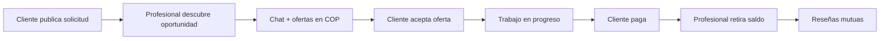

# Ranco — Documentación del prototipo

## Nombre

**Ranco** — marketplace móvil de servicios locales en tiempo real.

**Versión del prototipo:** 1.0.0 (MVP)  
**Paquete Android/iOS:** `com.ranco.app`  
**Organización Expo:** `@kiwi777/ranco`

---

## Descripción

Ranco es una plataforma que conecta **personas que necesitan un servicio** con **profesionales independientes cercanos**. El foco está en la confianza, la reputación, la interacción en tiempo real y la contratación rápida en un entorno local.

El prototipo actual es un **MVP funcional** orientado a validar el flujo completo: publicar una solicitud → negociar precio → contratar → ejecutar el trabajo → pagar → calificar. Está pensado para el mercado colombiano (precios en COP, términos legales y comisiones adaptadas).

### Elevator pitch (30 segundos)

> Ranco es el marketplace local que une clientes y profesionales de servicios informales y formales — plomería, limpieza, cuidado, belleza, transporte y más — en una sola app. Publicas lo que necesitas, recibes ofertas de profesionales cercanos, negocias el precio en chat, contratas con confianza gracias a reseñas verificadas y pagas de forma segura. Los profesionales descubren oportunidades en su zona, construyen reputación y pueden destacar con planes Pro.

---

## Problema que resuelve

- **Clientes:** encontrar profesionales confiables cerca, comparar ofertas y cerrar un acuerdo sin fricción ni incertidumbre sobre el precio.
- **Profesionales:** acceder a demanda local filtrada por sus habilidades, negociar de forma estructurada y construir reputación visible.
- **Mercado informal:** muchos servicios locales se coordinan por WhatsApp sin historial, reputación ni pagos trazables. Ranco digitaliza ese flujo manteniendo la cercanía humana.

---

## Tipos de usuario

| Rol | Descripción |
|-----|-------------|
| **Cliente** | Publica solicitudes de servicio, recibe ofertas, contrata y paga. |
| **Profesional** | Descubre oportunidades, envía ofertas, ejecuta trabajos y cobra. |
| **Híbrido** | Una misma cuenta puede ser cliente y profesional; el usuario cambia de modo dentro de la app. |

---

## Funcionalidades implementadas

### Autenticación y acceso

- Registro e inicio de sesión con email y contraseña (Supabase Auth).
- Recuperación de contraseña.
- Sesión persistente y cierre de sesión seguro.
- Redirección automática según estado de autenticación y onboarding.

### Onboarding y perfil

- Flujo guiado en varios pasos: foto, nombre, teléfono, selección de rol(es).
- Activación del rol **cliente**, **profesional** o ambos.
- Configuración de áreas de servicio para profesionales (categorías y subcategorías).
- Edición de perfil, avatar y datos de contacto.
- Perfil público visible para otros usuarios (cliente o profesional según contexto).
- Cambio dinámico de modo (cliente ↔ profesional) con tabs adaptativas.

### Solicitudes de servicio (cliente)

- Creación de solicitudes con título, descripción, categoría y subcategoría.
- Selector de urgencia, fotos adjuntas y ubicación en mapa (Google Maps).
- Publicación, edición (mientras aplique) y cancelación.
- Seguimiento del ciclo de vida del trabajo.
- Listado agrupado en la pestaña **Proyectos**.

**Estados del servicio:**

`published` → `in_negotiation` → `accepted` → `in_progress` → `completed` / `cancelled`

### Descubrimiento y oportunidades (profesional)

- Feed de solicitudes publicadas filtradas por las áreas de servicio del profesional.
- Tarjetas con datos del cliente, ubicación, urgencia y categoría.
- Badge visual para solicitudes de clientes **Pro**.
- Contacto directo que abre conversación vinculada a la solicitud.

### Ofertas y negociación

- Envío de ofertas con monto en COP desde el chat.
- Contraofertas, aceptación, rechazo y retiro de ofertas.
- Tarjetas estructuradas de oferta dentro del hilo de mensajes.
- Precio acordado registrado al aceptar una oferta.
- Actualizaciones en tiempo real vía Supabase Realtime.

### Chat en tiempo real

- Mensajería 1:1 entre cliente y profesional por solicitud.
- Historial de conversaciones en la pestaña **Mensajes**.
- Indicadores de lectura y entrega.
- Integración de ofertas dentro del chat.

### Reseñas y reputación

- Calificación mutua tras completar un trabajo.
- Sistema multi-atributo (puntualidad, comunicación, calidad, etc.) según el rol evaluado.
- Evidencia fotográfica del trabajo realizado.
- Resumen de reputación en perfil público y propio.
- Actualización en tiempo real de reseñas recibidas.

### Pagos (simulados en MVP)

- Flujo de pago del cliente al completar el trabajo (simulación de tarjeta).
- Flujo de retiro del profesional (simulación de payout).
- Comisión de plataforma: **5% al cliente** sobre el precio acordado + **5% al profesional** al retirar.
- Pantalla de términos de pagos con explicación legal del rol de Ranco como intermediario.
- Notificaciones de eventos de pago.

### Planes Pro (suscripciones simuladas)

Planes separados por rol con cambio simulado (sin pasarela real aún):

| Plan | Precio mensual | Precio anual (−20%) |
|------|----------------|---------------------|
| Ranco Pro Cliente | $29.900 COP | $287.040 COP |
| Ranco Pro Profesional | $29.900 COP | $287.040 COP |

**Beneficios Pro Cliente:** ofertas priorizadas, mayor visibilidad, etiqueta de solicitud prioritaria, filtros avanzados, soporte prioritario, métricas avanzadas.

**Beneficios Pro Profesional:** insignia Pro, mayor visibilidad en postulaciones, prioridad en búsqueda, estadísticas avanzadas, mayor radio de alcance, herramientas de gestión.

### Home y exploración

- Dashboard adaptado al modo activo (cliente o profesional).
- Carrusel de categorías de servicio.
- Búsqueda rápida para crear solicitudes.
- Profesionales destacados (ranking con prioridad Pro).
- Tarjeta de servicio activo en curso.
- Actividad reciente.

### Notificaciones

- Centro de notificaciones in-app.
- Tipos: nuevas ofertas, ofertas aceptadas/rechazadas, mensajes, cambios de estado, pagos, reseñas.
- Push notifications (Firebase / Expo Notifications) con configuración en backend.
- Campana de notificaciones en headers principales.

### Legal y transparencia

- Pantalla de **Términos de pagos** con secciones sobre rol de intermediario, flujo de pago, comisiones y responsabilidades.
- Avisos contextuales en flujos de negociación y pago.

### Experiencia de arranque

- Splash nativo de solo color (claro/oscuro).
- Animación Lottie de bienvenida (`welcome.json`) antes del contenido principal.
- Soporte de tema claro y oscuro en toda la app.

---

## Categorías de servicio

9 categorías principales con decenas de subcategorías:

| Categoría | Ejemplos de subcategorías |
|-----------|---------------------------|
| Hogar | Plomería, electricidad, pintura, limpieza, carpintería, jardinería |
| Reparaciones | Cerrajería, electrodomésticos, equipos, gas |
| Servicios | Diligencias, soporte técnico, fotografía, costura |
| Cuidado | Niños, adultos mayores, mascotas |
| Otros | Idiomas, música, deportes, manejo |
| Transporte | Mudanzas, mensajería, transporte local |
| Belleza | Peluquería, barbería, uñas, maquillaje |
| Educación | Apoyo escolar, informática, arte |
| Eventos | Catering, decoración, animación |

---

## Flujo principal del producto



1. El **cliente** crea una solicitud con ubicación, fotos y urgencia.
2. Los **profesionales** compatibles la ven en **Oportunidades** y abren chat.
3. Se **negocia el precio** con ofertas estructuradas.
4. Al **aceptar**, la solicitud pasa a contratada y el trabajo puede iniciarse.
5. Al **completar**, el cliente **paga** (simulado) y el profesional **retira** su saldo neto.
6. Ambas partes dejan **reseñas** con atributos y evidencia.

---

## Modelo de negocio

| Fuente | Detalle |
|--------|---------|
| Comisión por transacción | 5% cobrado al cliente + 5% descontado al profesional sobre el precio acordado |
| Suscripciones Pro | $29.900/mes o $287.040/año por rol (cliente o profesional) |
| Futuro | Pagos reales, wallets, verificación de identidad, escrow |

---

## Stack tecnológico

| Capa | Tecnología |
|------|------------|
| Mobile | Expo SDK 56, React Native, TypeScript |
| Navegación | Expo Router (file-based) |
| Estado servidor | TanStack Query |
| Estado local | Zustand |
| Formularios | React Hook Form + Zod |
| Backend | Supabase (PostgreSQL, Auth, Realtime, Storage, RLS) |
| Mapas | react-native-maps + Google Maps API |
| Animaciones | Reanimated, Lottie |
| Builds | EAS Build + EAS Update |
| Push | Expo Notifications + Firebase (google-services.json) |

---

## Arquitectura del código

Organización **feature-first**:

```
src/
  app/           → Rutas y pantallas (Expo Router)
  features/      → Módulos de dominio (auth, jobs, offers, payments…)
  components/    → UI reutilizable
  services/      → Infraestructura (Supabase, storage)
  stores/        → Estado global Zustand
  constants/     → Tema, rutas, splash
supabase/
  migrations/    → Esquema PostgreSQL + RLS + RPCs
```

---

## Qué es real vs. simulado en este MVP

| Área | Estado |
|------|--------|
| Auth, perfiles, solicitudes, chat, ofertas, reseñas | **Funcional** con Supabase |
| Realtime (chat, ofertas, reseñas) | **Funcional** |
| Geolocalización y mapas | **Funcional** (requiere API key) |
| Push notifications | **Configurado** (requiere build nativo) |
| Pagos | **Simulado** (RPCs de demo, sin pasarela real) |
| Suscripciones Pro | **Simulado** (cambio de plan en backend, sin cobro real) |
| Verificación de identidad / KYC | **No implementado** |
| Pagos escrow / wallets | **No implementado** |

---

## Información útil para presentar el proyecto

### Puntos clave para inversores o stakeholders

1. **Mercado amplio:** servicios informales y formales locales (hogar, cuidado, belleza, transporte, educación).
2. **Doble lado en una app:** mismo usuario puede pedir y ofrecer servicios.
3. **Confianza integrada:** reseñas multi-atributo, evidencia fotográfica y perfiles públicos.
4. **Monetización dual:** comisiones por transacción + suscripciones Pro.
5. **Time-to-market:** MVP construido sobre Supabase y Expo para iterar rápido.
6. **Enfoque local:** proximidad geográfica, COP, profesionales independientes cercanos.

### Diferenciadores del prototipo

- Negociación de precio **estructurada dentro del chat** (no solo mensajes libres).
- Ciclo de vida completo del trabajo con estados claros.
- Modo híbrido cliente/profesional sin cuentas separadas.
- Ranking de profesionales destacados con ventaja Pro.
- Términos legales de pagos integrados en la experiencia.

### Demo sugerida (5–7 minutos)

1. Registro / login → onboarding como cliente y profesional.
2. Crear solicitud con mapa y fotos.
3. Cambiar a modo profesional → ver oportunidad → enviar oferta.
4. Volver a cliente → aceptar oferta en chat.
5. Avanzar estados → completar → simular pago y retiro.
6. Dejar reseña → ver perfil público y badge Pro.
7. Mostrar pantalla de Planes Pro y términos de pagos.

### Limitaciones actuales (transparencia)

- Pagos y suscripciones son simulaciones para validar UX y flujos.
- No hay verificación de identidad ni antecedentes.
- iOS en fase de configuración; Android es el foco principal de builds preview.
- Requiere variables de entorno (Supabase, Google Maps) y build nativo para mapas/push/splash reales.

---

## Builds y despliegue

- **Preview Android:** APK interno vía EAS (`npm run eas:build:preview`).
- **Production:** builds con auto-incremento de versión.
- **OTA updates:** EAS Update configurado con `runtimeVersion` por versión de app.
- Variables en EAS: Supabase URL/anon key, Google Maps API key (Android).

Ver [README.md](../README.md) para setup local, splash, mapas y diagnóstico de crashes.

---

## Roadmap sugerido (post-MVP)

1. Integración de pasarela de pagos real (PSE, tarjetas, Nequi, etc.).
2. Cobro real de suscripciones Pro.
3. Verificación de identidad y badges de confianza.
4. Filtros avanzados por distancia, rating y disponibilidad.
5. Presencia online / disponibilidad del profesional.
6. Soporte multi-ciudad y multi-país.
7. Publicación en App Store y Google Play.

---

## Contacto del proyecto

- **Repositorio:** Ranco App (Expo + Supabase)
- **Expo project:** `@kiwi777/ranco`
- **Bundle ID:** `com.ranco.app`
